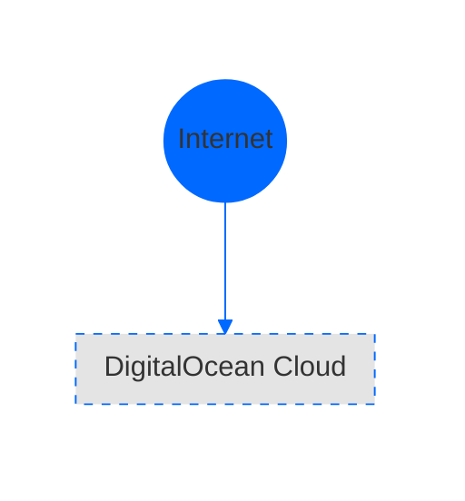
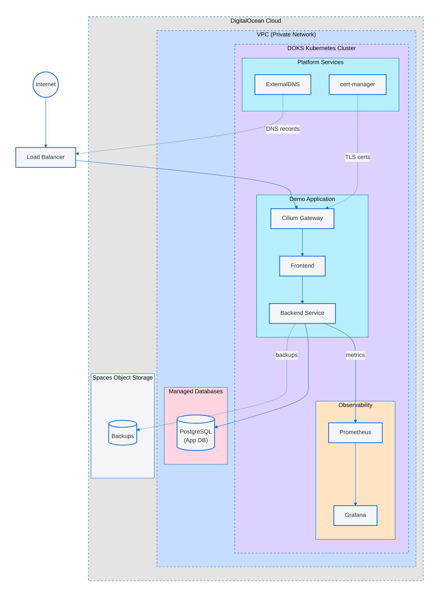

# CLAUDE.md

This file provides guidance to Claude Code (claude.ai/code) when working with code in this repository.

## Repository Overview

This is the **Scale With Simplicity** repository - DigitalOcean's collection of Reference Architectures (RAs) demonstrating how to build production-grade solutions on DigitalOcean using Terraform. Each RA is a fully deployable example that orchestrates reusable Terraform modules from the [Terraform Module Library](./TERRAFORM-MODULE-LIBRARY.md).

## Repository Structure

```
scale-with-simplicity/
├── modules/                        # Reusable Terraform modules
│   ├── glb-stack/                  # Global Load Balancer stack
│   ├── ipsec-gateway/              # IPSec VPN gateway droplet
│   ├── multi-region-vpc/           # Multi-region VPC mesh with peering
│   └── partner-network-connect-aws/ # DO to AWS via Megaport
├── reference-architectures/
│   └── <ra-slug>/
│       ├── README.md               # Documentation with embedded Mermaid diagram, prerequisites, inputs, outputs
│       ├── Makefile                # Standard targets: lint, test-unit, test-integration
│       ├── k8s/                    # Kubernetes manifests (optional, for RAs with K8s resources)
│       │   ├── namespace.yaml
│       │   ├── deployment.yaml
│       │   └── ...
│       ├── terraform/              # Main RA implementation (or terraform/1-infra/, 2-cluster/, etc. for multi-stack)
│       │   ├── main.tf             # Module invocations and RA-specific resources
│       │   ├── variables.tf        # Input variable definitions
│       │   ├── outputs.tf          # Outputs for tests and documentation
│       │   └── terraform.tf        # Backend and provider configuration
│       └── test/
│           ├── go.mod              # Test dependencies with helper library
│           ├── test.tfvars         # Baseline variable values for testing
│           ├── unit/               # Terraform plan validation tests
│           │   └── unit_test.go
│           └── integration/        # Full apply/destroy tests
│               └── apply_destroy_test.go
├── test/                           # Shared test helpers and scripts
│   ├── helper/                     # Go helper functions (godo client, CIDR management, etc.)
│   ├── scripts/                    # Reusable shell scripts for validation
│   │   ├── terraform-validate.sh   # Runs terraform init, validate, fmt check
│   │   ├── tflint.sh               # Runs tflint with shared config
│   │   └── terratest.sh            # Runs Go tests
│   └── constant/                   # Test constants
└── .github/workflows/              # CI workflows for each RA
```

## Common Commands

All reference architectures follow a standard Makefile pattern. Navigate to `reference-architectures/<ra-slug>/` and run:

### Linting and Validation

```bash
# Run all linting (terraform validate, fmt, and tflint)
make lint

# Run just terraform validation
make tf-validate

# Run just tflint
make tflint
```

### Testing

```bash
# Run unit tests (terraform plan validation)
make test-unit

# Run integration tests (full apply/destroy cycle)
make test-integration
```

### Terraform Operations

From within `reference-architectures/<ra-slug>/terraform/`:

```bash
# Initialize terraform
terraform init

# Plan with tfvars file
terraform plan -var-file=<path-to-tfvars>

# Apply deployment
terraform apply -var-file=<path-to-tfvars>

# Destroy resources
terraform destroy -var-file=<path-to-tfvars>
```

**Environment Setup**: Set `DIGITALOCEAN_TOKEN` (or `DIGITALOCEAN_ACCESS_TOKEN` for tests) environment variable with your DigitalOcean API token. Multi-cloud RAs may also require `AWS_ACCESS_KEY_ID` and `AWS_SECRET_ACCESS_KEY`.

## Architecture Principles

### When to Create Modules vs. Inline Resources

**Create a reusable module when**:
- Orchestrating multiple related resources as a cohesive unit
- The pattern would be reused across multiple RAs
- Complex logic needs to be encapsulated with clear inputs/outputs
- Example: multi-region VPC mesh, GLB stack, IPSec gateway

**Use inline resources in main.tf when**:
- Resources are specific to a single RA
- Simple, one-off configurations
- Example: droplets with user_data, certificates, SSH key lookups

### Module References

Reference reusable Terraform modules using relative paths from the `modules/` directory:
```hcl
module "multi_region_vpc" {
  source      = "../../../modules/multi-region-vpc"
  name_prefix = var.name_prefix
  vpcs        = var.vpcs
}
```

The relative path depends on your Terraform directory depth. For reference architectures at `reference-architectures/<ra-slug>/terraform/`, the path is `../../../modules/<module-name>`.

See [TERRAFORM-MODULE-LIBRARY.md](./TERRAFORM-MODULE-LIBRARY.md) for available modules.

### Naming Conventions

- All resources use `name_prefix` variable for consistent naming and tagging
- Droplets and resources are tagged to enable load balancer targeting
- Test names use format `test-<random-id>` to avoid collisions

## Multi-Stack Deployments

Some RAs split deployment into sequential stacks (e.g., `terraform/1-infra/`, `terraform/2-cluster/`, `terraform/3-environment/`):
- Stack dependencies (e.g., Kubernetes provider needs cluster from previous stack)
- CRD dependencies (e.g., ServiceMonitor requires kube-prometheus-stack)

Each stack has its own terraform directory with separate main.tf, variables.tf, outputs.tf, and terraform.tf files.

### Multi-Stack Makefile Pattern

```makefile
MAKEFILE_PATH := $(abspath $(lastword $(MAKEFILE_LIST)))
MAKEFILE_DIR := $(dir $(MAKEFILE_PATH))
TEST_SCRIPT_DIR := $(realpath $(MAKEFILE_DIR)/../../test/scripts)

.PHONY: tf-validate-infra
tf-validate-infra:
	@cd terraform/1-infra && $(TEST_SCRIPT_DIR)/terraform-validate.sh

.PHONY: tf-validate-cluster
tf-validate-cluster:
	@cd terraform/2-cluster && $(TEST_SCRIPT_DIR)/terraform-validate.sh

.PHONY: tf-validate
tf-validate: tf-validate-infra tf-validate-cluster

.PHONY: tflint
tflint:
	@cd terraform && $(TEST_SCRIPT_DIR)/tflint.sh

.PHONY: lint
lint: tf-validate tflint

.PHONY: test-unit
test-unit:
	cd test/unit && $(TEST_SCRIPT_DIR)/terratest.sh

.PHONY: test-integration
test-integration:
	cd test/integration && $(TEST_SCRIPT_DIR)/terratest.sh
```

### Multi-Stack State Management

Stack 2+ can read outputs from previous stacks using `terraform_remote_state`:

```hcl
data "terraform_remote_state" "infra" {
  backend = "local"
  config = {
    path = "../1-infra/terraform.tfstate"
  }
}

# Use outputs from previous stack
data "digitalocean_kubernetes_cluster" "cluster" {
  name = data.terraform_remote_state.infra.outputs.cluster_name
}
```

### Kubernetes/Helm Provider Configuration (Stack 2+)

When deploying to Kubernetes in later stacks, configure providers using the cluster data:

```hcl
data "digitalocean_kubernetes_cluster" "doks_cluster" {
  name = var.name_prefix
}

provider "kubernetes" {
  host  = data.digitalocean_kubernetes_cluster.doks_cluster.endpoint
  token = data.digitalocean_kubernetes_cluster.doks_cluster.kube_config[0].token
  cluster_ca_certificate = base64decode(
    data.digitalocean_kubernetes_cluster.doks_cluster.kube_config[0].cluster_ca_certificate
  )
}

provider "helm" {
  kubernetes {
    host  = data.digitalocean_kubernetes_cluster.doks_cluster.endpoint
    token = data.digitalocean_kubernetes_cluster.doks_cluster.kube_config[0].token
    cluster_ca_certificate = base64decode(
      data.digitalocean_kubernetes_cluster.doks_cluster.kube_config[0].cluster_ca_certificate
    )
  }
}
```

## Terraform Patterns

### Dynamic Droplet Slug Selection

Find the most cost-effective droplet size meeting specific criteria:

```hcl
data "digitalocean_sizes" "slug_2vcpu_4gb" {
  filter {
    key    = "vcpus"
    values = [2]
  }
  filter {
    key    = "memory"
    values = [4096]
  }
  filter {
    key    = "regions"
    values = [var.region]
  }
  sort {
    key       = "price_monthly"
    direction = "asc"
  }
}

# Use: data.digitalocean_sizes.slug_2vcpu_4gb.sizes[0].slug
```

### DOKS Cluster with Auto-Scaling

```hcl
data "digitalocean_kubernetes_versions" "all" {}

resource "digitalocean_kubernetes_cluster" "primary" {
  name                             = var.name_prefix
  region                           = var.region
  version                          = data.digitalocean_kubernetes_versions.all.latest_version
  vpc_uuid                         = digitalocean_vpc.main.id
  cluster_subnet                   = var.doks_cluster_subnet
  service_subnet                   = var.doks_service_subnet
  destroy_all_associated_resources = true
  ha                               = var.doks_control_plane_ha
  tags                             = local.tags

  node_pool {
    name       = "${var.name_prefix}-${data.digitalocean_sizes.slug_2vcpu_4gb.sizes[0].slug}"
    size       = data.digitalocean_sizes.slug_2vcpu_4gb.sizes[0].slug
    auto_scale = true
    min_nodes  = var.doks_node_pool_min_nodes
    max_nodes  = var.doks_node_pool_max_nodes
    tags       = local.tags
  }
}
```

Always define cluster_subnet and service_subnet as this ensures the DOKS cluster is VPC integrated.

### Helm Release Pattern

```hcl
resource "helm_release" "cert_manager" {
  name       = "cert-manager"
  repository = "https://charts.jetstack.io"
  chart      = "cert-manager"
  namespace  = "cluster-services"

  set {
    name  = "crds.enabled"
    value = true
  }

  set {
    name  = "config.enableGatewayAPI"
    value = true
  }
}
```

### Kubernetes Manifests with yamldecode Pattern

For RAs that deploy Kubernetes resources, prefer storing manifests as separate YAML files in a `k8s/` directory rather than defining them inline in Terraform. This approach:
- Keeps manifests readable and kubectl-compatible
- Enables IDE support for YAML/Kubernetes schemas
- Separates concerns between infrastructure orchestration and resource definitions

**Directory structure:**
```
<ra-slug>/
├── k8s/
│   ├── namespace.yaml
│   ├── deployment.yaml
│   ├── service.yaml
│   └── ...
└── terraform/
    └── 2-vllm/
        └── main.tf        # Uses yamldecode to load manifests
```

**Static manifests** - Use `file()` for manifests without variables:

```hcl
resource "kubernetes_manifest" "namespace" {
  manifest = yamldecode(file("${path.module}/../../k8s/namespace.yaml"))
}
```

**Templated manifests** - Use `templatefile()` for manifests requiring variable substitution:

```hcl
resource "kubernetes_manifest" "deployment" {
  manifest = yamldecode(templatefile("${path.module}/../../k8s/deployment.yaml", {
    model_name = local.model_name
    replicas   = var.replicas
  }))

  depends_on = [kubernetes_manifest.namespace]
}
```

**YAML template syntax** - Use `${variable}` placeholders in the YAML files:

```yaml
# k8s/deployment.yaml
apiVersion: apps/v1
kind: Deployment
metadata:
  name: vllm
  namespace: vllm
spec:
  replicas: ${replicas}
  template:
    spec:
      containers:
        - name: vllm
          args:
            - --model
            - /models/${model_name}
```

**Secrets with computed_fields** - When creating Secrets with `stringData`, use `computed_fields` to prevent drift:

```hcl
resource "kubernetes_manifest" "secret" {
  manifest = yamldecode(templatefile("${path.module}/../../k8s/secret.yaml", {
    token = var.api_token
  }))

  # Kubernetes converts stringData to base64-encoded data and removes stringData
  computed_fields = ["stringData"]

  depends_on = [kubernetes_manifest.namespace]
}
```

**Jobs with wait conditions** - Wait for Jobs to complete before proceeding:

```hcl
resource "kubernetes_manifest" "setup_job" {
  manifest = yamldecode(file("${path.module}/../../k8s/setup-job.yaml"))

  wait {
    condition {
      type   = "Complete"
      status = "True"
    }
  }

  timeouts {
    create = "60m"
  }

  depends_on = [kubernetes_manifest.pvc]
}
```

See `reference-architectures/vllm-nfs/` for a complete example of this pattern.

## Architecture Diagrams (Mermaid)

Each RA includes an architecture diagram using Mermaid format. Diagrams must be embedded inline in the README so they render when viewing the README on GitHub.

### Embedding Diagrams in README

Embed the diagram directly in the README using a mermaid code block. GitHub renders Mermaid diagrams natively when they are in a ```mermaid code block:

```markdown
## Architecture

```mermaid
%%{init: {'theme': 'base', 'themeVariables': {...}}}%%
flowchart TB
    %% Diagram content here
```
```

**Important**: GitHub does not support referencing external `.mmd` files for inline rendering. The diagram must be embedded directly in the README for it to display when users view the documentation.

### DigitalOcean Diagram Style Guide

Follow the DigitalOcean color palette and styling conventions for consistent diagrams across all RAs.

#### Theme Initialization

Always start diagrams with a theme initialization directive to ensure consistent colors and fonts:


#### Dark Mode Support

To ensure diagrams display correctly on dark backgrounds (e.g., GitHub dark mode), wrap all diagram content in an outer `Wrapper` subgraph with a white background. This provides a consistent light background for all elements including connecting lines between subgraphs:



**Key points:**
- Use `subgraph Wrapper[" "]` with a space as the label to create an invisible container
- Place ALL nodes, subgraphs, and connections inside the Wrapper
- Style the Wrapper with `fill:#FFFFFF,stroke:#FFFFFF` to create a seamless white background
- Styling directives can remain outside the Wrapper subgraph

#### Color Palette

**Subgraph Background Colors:**

| Element Type | Background Color | Usage |
|--------------|------------------|-------|
| Light Grey | `#E5E4E4` | Outer containers, cloud regions |
| Light Blue | `#C6DDFF` | VPC, network groupings |
| Light Purple | `#DCD1FF` | Kubernetes clusters |
| Light Teal | `#B7EFFE` | Application groupings, platform services |
| Light Orange | `#FFE4C4` | Observability, monitoring components |
| Light Pink | `#FFD6E0` | Managed databases |
| Light Gray | `#F3F5F9` | Storage, general groupings |

**Node Colors:**

All component nodes use light gray fill (`#F3F5F9`) with blue stroke (`#0069FF`). Do NOT use solid blue fill for nodes.

#### Direction Directives

Use `direction` within subgraphs to control layout flow:

```mermaid
subgraph VPC["VPC (Private Network)"]
    direction TB

    subgraph DOKS["DOKS Kubernetes Cluster"]
        direction LR
        ...
    end
end
```

- `direction TB` - Top to bottom (vertical stacking)
- `direction LR` - Left to right (horizontal arrangement)

#### Node Syntax Conventions

Use quotes in node labels and appropriate shapes:

```mermaid
%% Standard nodes - use quotes
Gateway["Cilium Gateway"]
Frontend["Frontend"]

%% Databases - cylinder shape with quotes
PostgreSQL[("PostgreSQL<br/>(AdService DB)")]
Valkey[("Valkey<br/>(CartService Cache)")]

%% External entry points - double parentheses for circles
Internet(("Internet"))

%% Multi-line labels - use <br/>
PGExporter["PGExporter<br/>(postgres-exporter)"]
```

#### Styling Approach

Apply styles individually to each node and subgraph at the **end** of the diagram file. Group all styling together for maintainability:

```mermaid
%% Subgraph styling - grouped at end
style DO fill:#E5E4E4,stroke:#0069FF,stroke-width:1px,stroke-dasharray:5
style VPC fill:#C6DDFF,stroke:#0069FF,stroke-width:1px,stroke-dasharray:5
style DOKS fill:#DCD1FF,stroke:#0069FF,stroke-width:1px,stroke-dasharray:5
style App fill:#B7EFFE,stroke:#0069FF,stroke-width:1px
style Obs fill:#FFE4C4,stroke:#0069FF,stroke-width:1px
style DBaaS fill:#FFD6E0,stroke:#0069FF,stroke-width:1px

%% Component nodes - all use light gray fill
style Gateway fill:#F3F5F9,stroke:#0069FF,stroke-width:2px
style Frontend fill:#F3F5F9,stroke:#0069FF,stroke-width:2px
style PostgreSQL fill:#F3F5F9,stroke:#0069FF,stroke-width:2px
```

**Style properties:**
- `stroke-width:1px` for subgraphs
- `stroke-width:2px` for component nodes
- `stroke-dasharray:5` for dashed borders on outer containers

#### Functional Grouping

Group components by **functional role**, not by Kubernetes namespace:

```mermaid
subgraph DOKS["DOKS Kubernetes Cluster"]
    subgraph App["Demo Application"]
        Gateway["Cilium Gateway"]
        Frontend["Frontend"]
    end

    subgraph Platform["Platform Services"]
        CertManager["cert-manager"]
        ExtDNS["ExternalDNS"]
    end

    subgraph Obs["Observability Platform"]
        Prometheus["Prometheus"]
        Grafana["Grafana"]
        Loki["Loki"]
    end
end
```

### Connection Labels

Use descriptive labels on connections to clarify data flows:

```mermaid
%% Traffic flow
Internet --> LB --> Gateway
Gateway --> Frontend

%% Labeled connections for clarity
PostgreSQL -->|metrics| PGExporter
PGExporter -->|scrape| Prometheus
PostgreSQL -.->|rsyslog/TLS| Alloy
LoadGen -.->|simulated<br/>traffic| Frontend
CertManager -.->|TLS certs| Gateway
```

- Solid arrows (`-->`) for primary data/traffic flow
- Dotted arrows (`-.->`) for secondary flows (metrics, logs, config)
- Use `<br/>` for multi-line labels

### Node Shape Reference

| Shape | Syntax | Use For |
|-------|--------|---------|
| Rectangle | `["text"]` | Services, components |
| Database | `[("text")]` | Databases, storage buckets |
| Circle | `(("text"))` | External entry points (Internet) |
| Rounded | `(["text"])` | Load balancers |

### Diagram Best Practices

1. **Start with theme init** - Always include the `%%{init:...}%%` directive
2. **Wrap in Wrapper subgraph** - Use `subgraph Wrapper[" "]` with white fill for dark mode support
3. **Define traffic flow first** - Establish the main flow early to guide layout
4. **Group by function** - Use subgraphs for App, Platform, Observability, Databases
5. **Use direction directives** - Control layout within subgraphs
6. **Label connections** - Use descriptive labels like `|rsyslog/TLS|`
7. **Style at the end** - Group all `style` directives at the bottom
8. **Use `<br/>` for clarity** - Multi-line labels improve readability

### Example Complete Diagram



## Testing Architecture

### Test Helper Library

Located in `test/helper/`, provides utilities for integration testing:

**Key Helper Functions**:
- `CreateGodoClient()` - Create DigitalOcean API client
- `CreateTestDomain(client, domain)` - Create test DNS domain
- `DeleteTestDomain(client, domain)` - Clean up test domain
- `CreateSshKey(client, name, publicKey)` - Create SSH key for tests
- `DeleteSshKey(client, keyId)` - Delete SSH key
- `TerraformDestroyVpcWithMembers(t, terraformOptions)` - Robust VPC cleanup with retries
- `NewCidrAssigner(ctx, client)` - Allocate non-overlapping CIDR blocks

**CidrAssigner Methods**:
- `GetVpcCidr()` - Allocate VPC CIDR block (/24)
- `GetDoksClusterCidr()` - Allocate DOKS cluster CIDR (/19)
- `GetDoksServiceCidr()` - Allocate DOKS service CIDR (/22)

### Test Go Module

Each RA's `test/go.mod` must include:

```go
module github.com/digitalocean/scale-with-simplicity/reference-architectures/<ra-slug>/test

go 1.24.2

require (
	github.com/digitalocean/godo v1.155.0
	github.com/digitalocean/scale-with-simplicity/test v0.0.0
	github.com/gruntwork-io/terratest v0.50.0
)

replace github.com/digitalocean/scale-with-simplicity/test => ../../../test
```

After creating `go.mod`, run `go mod tidy` to generate `go.sum`.

### Test Variables (`test.tfvars`)

- Located at `<ra-slug>/test/test.tfvars`
- Provides baseline values for both unit and integration tests
- Should NOT contain secrets (API tokens, SSH keys) - generate these dynamically in test code
- Tests can override values using `terraform.VarInline()`

### Unit Tests Pattern

Unit tests validate that `terraform plan` succeeds without errors.

**Single-Stack RA (uses local modules from `modules/`):**

When your RA references modules via relative paths like `../../../modules/`, you must copy from repo root to preserve those paths:

```go
func TestPlan(t *testing.T) {
	t.Parallel()

	// Copy from repo root to preserve relative module paths (../../../modules/)
	tempRoot := test_structure.CopyTerraformFolderToTemp(t, "../../../..", ".")
	testDir := filepath.Join(tempRoot, "reference-architectures", "<ra-slug>", "terraform")
	err := files.CopyFile("../test.tfvars", filepath.Join(testDir, "test.tfvars"))
	if err != nil {
		t.Fatalf("Failed to copy tfvars file: %v", err)
	}

	terraformOptions := terraform.WithDefaultRetryableErrors(t, &terraform.Options{
		TerraformDir: testDir,
		MixedVars:    []terraform.Var{terraform.VarFile("test.tfvars")},
		NoColor:      true,
		PlanFilePath: "plan.out",
	})

	terraform.InitAndPlanAndShow(t, terraformOptions)
}
```

**Single-Stack RA (no local modules):**

If your RA only uses remote modules (registry or git), you can use the simpler pattern:

```go
func TestPlan(t *testing.T) {
	t.Parallel()

	testDir := test_structure.CopyTerraformFolderToTemp(t, "../..", "./terraform")
	err := files.CopyFile("../test.tfvars", filepath.Join(testDir, "test.tfvars"))
	if err != nil {
		t.Fatalf("Failed to copy tfvars file: %v", err)
	}

	terraformOptions := terraform.WithDefaultRetryableErrors(t, &terraform.Options{
		TerraformDir: testDir,
		MixedVars:    []terraform.Var{terraform.VarFile("test.tfvars")},
		NoColor:      true,
		PlanFilePath: "plan.out",
	})

	terraform.InitAndPlanAndShow(t, terraformOptions)
}
```

**Multi-Stack RA (Stack 1 only - Stack 2+ requires real cluster):**

```go
func TestPlanInfra(t *testing.T) {
	t.Parallel()

	testDir := test_structure.CopyTerraformFolderToTemp(t, "../..", "./terraform/1-infra")
	err := files.CopyFile("../test.tfvars", filepath.Join(testDir, "test.tfvars"))
	if err != nil {
		t.Fatalf("Failed to copy tfvars file: %v", err)
	}

	terraformOptions := terraform.WithDefaultRetryableErrors(t, &terraform.Options{
		TerraformDir: testDir,
		MixedVars:    []terraform.Var{terraform.VarFile("test.tfvars")},
		NoColor:      true,
		PlanFilePath: "plan.out",
	})

	terraform.InitAndPlanAndShow(t, terraformOptions)
}

// Note: Stack 2+ cannot be unit tested - requires real cluster and prior state
```

### Integration Tests Pattern

Integration tests perform full apply/destroy lifecycle.

**Single-Stack RA (uses local modules from `modules/`):**

When your RA references modules via relative paths like `../../../modules/`, you must copy from repo root to preserve those paths:

```go
func TestApplyAndDestroy(t *testing.T) {
	t.Parallel()

	testNamePrefix := fmt.Sprintf("test-%s", strings.ToLower(random.UniqueId()))

	// Copy from repo root to preserve relative module paths (../../../modules/)
	tempRoot := test_structure.CopyTerraformFolderToTemp(t, "../../../..", ".")
	testDir := filepath.Join(tempRoot, "reference-architectures", "<ra-slug>", "terraform")
	if err := files.CopyFile("../test.tfvars", filepath.Join(testDir, "test.tfvars")); err != nil {
		t.Fatalf("Failed to copy tfvars file: %v", err)
	}

	terraformOptions := terraform.WithDefaultRetryableErrors(t, &terraform.Options{
		TerraformDir: testDir,
		MixedVars: []terraform.Var{
			terraform.VarFile("test.tfvars"),
			terraform.VarInline("name_prefix", testNamePrefix),
		},
		NoColor: true,
	})

	defer helper.TerraformDestroyVpcWithMembers(t, terraformOptions)

	terraform.InitAndApply(t, terraformOptions)
}
```

**Single-Stack RA (no local modules):**

If your RA only uses remote modules (registry or git), you can use the simpler pattern:

```go
func TestApplyAndDestroy(t *testing.T) {
	t.Parallel()

	testNamePrefix := fmt.Sprintf("test-%s", strings.ToLower(random.UniqueId()))

	testDir := test_structure.CopyTerraformFolderToTemp(t, "../..", "./terraform")
	if err := files.CopyFile("../test.tfvars", filepath.Join(testDir, "test.tfvars")); err != nil {
		t.Fatalf("Failed to copy tfvars file: %v", err)
	}

	terraformOptions := terraform.WithDefaultRetryableErrors(t, &terraform.Options{
		TerraformDir: testDir,
		MixedVars: []terraform.Var{
			terraform.VarFile("test.tfvars"),
			terraform.VarInline("name_prefix", testNamePrefix),
		},
		NoColor: true,
	})

	defer helper.TerraformDestroyVpcWithMembers(t, terraformOptions)

	terraform.InitAndApply(t, terraformOptions)
}
```

**Multi-Stack RA:**

```go
func TestApplyAndDestroy(t *testing.T) {
	t.Parallel()

	testNamePrefix := fmt.Sprintf("test-%s", strings.ToLower(random.UniqueId()))
	ctx := context.Background()
	client := helper.CreateGodoClient()
	cidrAssigner := helper.NewCidrAssigner(ctx, client)

	vpcCidr := cidrAssigner.GetVpcCidr()
	clusterCidr := cidrAssigner.GetDoksClusterCidr()
	serviceCidr := cidrAssigner.GetDoksServiceCidr()

	// Copy entire terraform directory to preserve relative path structure for remote_state
	testDir := test_structure.CopyTerraformFolderToTemp(t, "../..", "./terraform")

	// Stack 1 Options
	stack1Options := terraform.WithDefaultRetryableErrors(t, &terraform.Options{
		TerraformDir: filepath.Join(testDir, "1-infra"),
		MixedVars: []terraform.Var{
			terraform.VarFile("test.tfvars"),
			terraform.VarInline("name_prefix", testNamePrefix),
			terraform.VarInline("vpc_cidr", vpcCidr),
			terraform.VarInline("doks_cluster_subnet", clusterCidr),
			terraform.VarInline("doks_service_subnet", serviceCidr),
		},
		NoColor: true,
	})
	defer helper.TerraformDestroyVpcWithMembers(t, stack1Options)
	terraform.InitAndApply(t, stack1Options)

	// Stack 2 Options - reads from remote state, may not need variables
	stack2Options := terraform.WithDefaultRetryableErrors(t, &terraform.Options{
		TerraformDir: filepath.Join(testDir, "2-cluster"),
		NoColor:      true,
	})
	defer terraform.Destroy(t, stack2Options)
	terraform.InitAndApply(t, stack2Options)
}
```

## CI/CD Workflows

### PR Check Workflow (Automatic)

A single dynamic workflow (`.github/workflows/pr-check.yaml`) automatically detects and tests any changed modules or reference architectures. No workflow configuration is needed when adding new modules or RAs.

The workflow:
1. Detects changed directories under `modules/` and `reference-architectures/`
2. Creates parallel test jobs for each changed directory
3. Runs `make lint` and `make test-unit` for each

**Adding a new RA or module requires NO workflow changes** - just ensure it has a standard Makefile with `lint` and `test-unit` targets.

### Integration Test Workflow (`<ra-slug>-integration-test.yaml`)

Scheduled daily or on-demand. Runs full apply/destroy tests. Each RA that requires integration testing needs its own workflow file with a unique cron schedule.

```yaml
name: <ra-slug> Apply-Destroy
on:
  schedule:
    - cron: "0 4 * * *"
  workflow_dispatch:

jobs:
  call-common:
    uses: ./.github/workflows/workflow-terraform-integration-test.yaml
    with:
      module_path: reference-architectures/<ra-slug>
    secrets:
      DIGITALOCEAN_ACCESS_TOKEN: ${{ secrets.TEST_DIGITALOCEAN_ACCESS_TOKEN }}
```

Both workflows use a shared Docker container image with Terraform, Go, and test tools pre-installed.

## Resource Cleanup (deepsix)

[deepsix](https://github.com/DO-Solutions/deepsix) runs nightly to clean up orphaned DigitalOcean resources left behind by failed or interrupted integration tests.

### Configuration (`.deepsix.yaml`)

The repo-root config file controls what deepsix skips:

```yaml
exclude_projects:
  - Infra

protected_resources:
  spaces-key:
    - name: scale-with-simplicity-pipeline
  registry:
    - name: scale-with-simplicity-test
```

- **`exclude_projects`** — Projects that are never touched. The `Infra` project holds long-lived infrastructure and must remain intact.
- **`protected_resources`** — Individual resources that must not be deleted, keyed by resource type. The Spaces key (`scale-with-simplicity-pipeline`) and the DOCR registry (`scale-with-simplicity-test`) are protected because they are shared by CI pipelines.

### Cleanup Workflow (`.github/workflows/deepsix-cleanup.yaml`)

Runs daily at midnight UTC (`0 0 * * *`) and can also be triggered manually via `workflow_dispatch`. The job executes inside the test container and runs:

```bash
deepsix --all --force
```

This deletes all non-protected resources across every non-excluded project. The workflow requires `DIGITALOCEAN_ACCESS_TOKEN`, `SPACES_ACCESS_KEY_ID`, and `SPACES_SECRET_ACCESS_KEY` secrets.

### Updating deepsix

The deepsix binary is installed in the test container from a private GitHub release (`DO-Solutions/deepsix`). To update:

1. Bump `DEEPSIX_VERSION` in `test/Dockerfile` (e.g., `ARG DEEPSIX_VERSION=v0.9.3`)
2. Rebuild the container:
   ```bash
   docker build --build-arg GITHUB_TOKEN=$GITHUB_TOKEN \
     -t registry.digitalocean.com/scale-with-simplicity-test/terraform-test:latest test/
   ```
3. Verify the version: `docker run --rm <image> deepsix --version`
4. Push to DOCR:
   ```bash
   doctl registry login
   docker push registry.digitalocean.com/scale-with-simplicity-test/terraform-test:latest
   ```

## Adding a New Reference Architecture

1. Create directory structure under `reference-architectures/<ra-slug>/`
2. Create Makefile with lint/test targets (use patterns above)
3. Implement Terraform code in `terraform/` directory (or `terraform/1-infra/`, etc. for multi-stack)
4. Create `test/test.tfvars` with baseline test values
5. Create `test/go.mod` and run `go mod tidy`
6. Write unit tests in `test/unit/unit_test.go`
7. Write integration tests in `test/integration/apply_destroy_test.go`
8. Create architecture diagram embedded in README.md following the Mermaid style guide
9. Write comprehensive README.md with prerequisites, inputs, outputs, and the embedded diagram
10. Add two GitHub workflow files for PR checks and integration tests
11. Update root README.md to include new RA in the table

See [CONTRIBUTE.md](./CONTRIBUTE.md) for detailed guidelines.

## Important Conventions

- **Module references**: Use relative paths to reference modules from the `modules/` directory
- **Resource naming**: Use `name_prefix` consistently across all resources
- **Tagging**: Tag droplets and resources for load balancer targeting and organization
- **Secrets**: Never commit secrets; use environment variables or generate dynamically in tests
- **Cleanup**: Always use `defer` with cleanup helpers in integration tests
- **Parallelism**: Use `t.Parallel()` in tests and unique prefixes to avoid collisions
- **CIDR management**: Use `CidrAssigner` helper to avoid network conflicts in tests
- **Kubernetes manifests**: Store K8s manifests in `k8s/` directory and load via `yamldecode()` rather than defining inline in Terraform
- **Architecture diagrams**: Embed Mermaid diagrams inline in README.md (not in separate files) so they render on GitHub, following the DigitalOcean style guide colors and conventions
