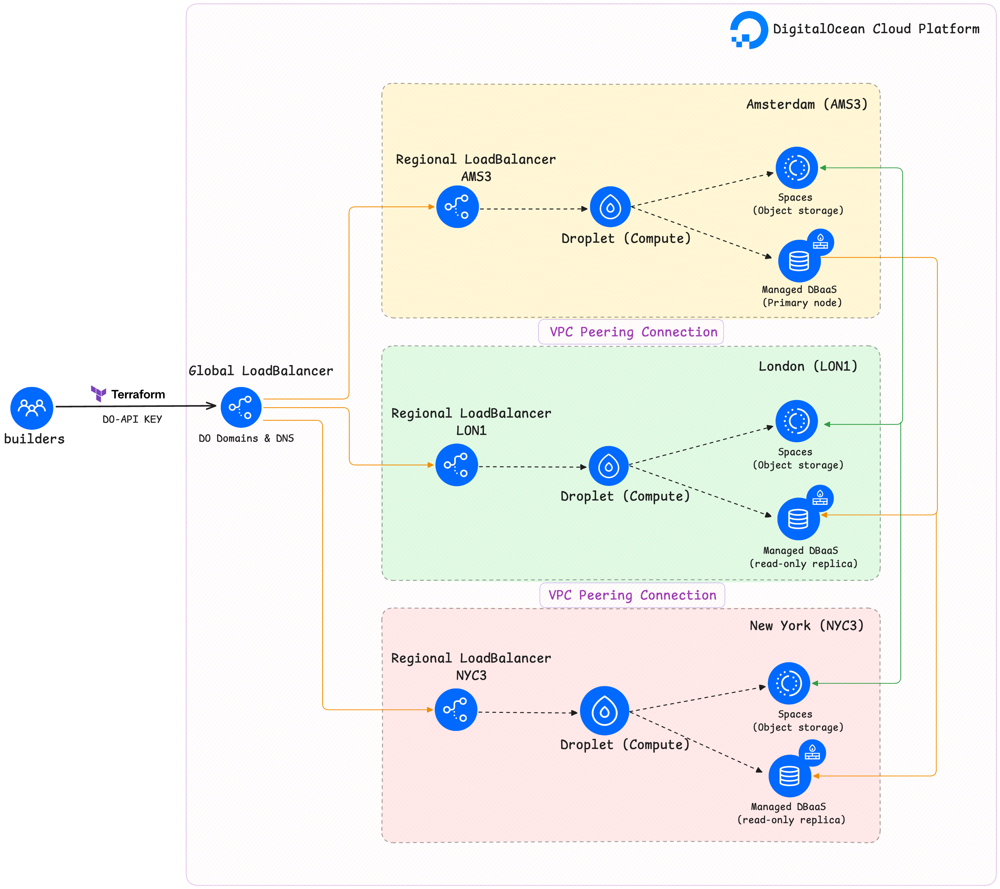

# Scale with Simplicity on DigitalOcean

Reference architectures to showcase how users can leverage DigitalOcean's robust cloud platform to build resilient, distributed systems at scale.



## Prerequisites

- [Terraform](https://www.terraform.io/downloads.html) installed on your machine
- [DigitalOcean Account](https://cloud.digitalocean.com/registrations/new) - Sign up here
- [DigitalOcean API Token](https://cloud.digitalocean.com/account/api/tokens)

## Setup

1. Clone this repository

   ```bash
   git clone https://github.com/digitalocean/scale-with-simplicity.git
   cd infrastructure
   ```

2. Create a `project.tfvars` file with your DigitalOcean API token:

   ```bash
   cp project.tfvars.example project.tfvars
   # Add your DO TOKEN
   do_token = "your-digitalocean-api-token"
   ```

   Note: Never commit this file to version control!

## Usage

1. Initialize Terraform:

   ```bash
   terraform init
   ```

2. Review the planned changes:

   ```bash
   terraform plan -var-file=project.tfvars -out project.out
   ```

3. Apply the changes:

   ```bash
   terraform apply "project.out"   
   ```

4. To destroy the infrastructure:

   ```bash
   terraform destroy -var-file="project.tfvars" 
   ```

## Project Structure

```bash
├── infrastructure/              # Terraform infrastructure code
│   ├── main.tf                  # Main architecture configuration
│   ├── variables.tf             # Architecture variables
│   ├── outputs.tf               # Terraform outputs
│   ├── provider.tf              # Provider configuration (DigitalOcean)
│   ├── vpc.tf                   # VPC configuration
│   ├── postgres.tf              # PostgreSQL database configuration
│   ├── spaces.tf                # DigitalOcean Spaces configuration
│   └── project.tfvars.example   # Example project variables file
```

## Security Notes

- Never commit your `project.tfvars` file or any files containing sensitive information
- Keep your DigitalOcean API token secure.
- Review the planned infrasture changes before applying them.


