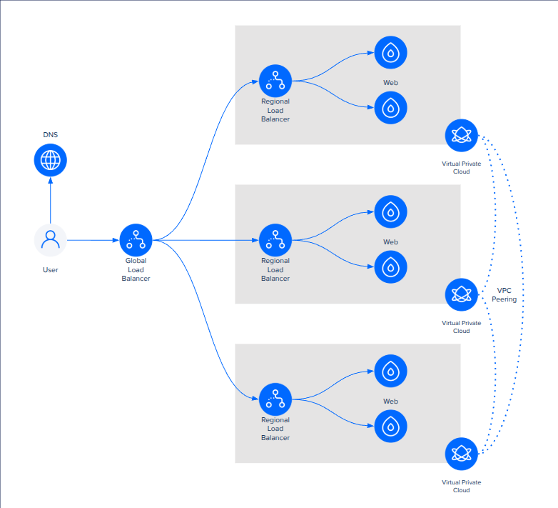

# Globally Load Balanced Web Servers

A Terraform composition that bootstraps a **multi-region, highly available web front end** on DigitalOcean. It builds:

1. Peered **VPCs** in each region (fully meshed) so regional resources can talk privately.
2. **Regional Load Balancers (RLBs)** in front of web droplets in each region.
3. A **Global Load Balancer (GLB)** that fronts the regionals, providing anycast IPs, optional HTTPS offload, automatic failover, and a CDN.
4. **DNS records** for direct regional access (e.g., `nyc3.example.com`).
5. **Web droplets** in each region, bootstrapped with nginx + Docker and tagged for targeting by the load balancers.

{width="700"}

## How it fits together

* The [terraform-digitalocean-multi-region-vpc](https://github.com/digitalocean/terraform-digitalocean-multi-region-vpc) submodule creates two or more VPCs in different regions and peers them in a full mesh so that internal traffic can flow region-to-region securely.
* The [terraform-digitalocean-glb-stack](https://github.com/digitalocean/terraform-digitalocean-glb-stack) submodule consumes those VPCs and:

    * Provisions one regional load balancer per region/VPC.
    * Exposes optional per-region DNS records for direct regional access.
    * Builds a global load balancer in front of the regionals with optional TLS termination, redirection, health checks, and CDN.
* Web droplets are created, tagged, and placed into each region; the regional load balancers target them via their tag.
* TLS, if enabled, is handled by issuing a Let's Encrypt certificate and wiring it into the forwarding rules for HTTPS.

## Prerequisites

* A DigitalOcean account with API access (e.g., via `DO_TOKEN` environment variable or provider configuration).
* Domain managed by DigitalOcean DNS if you want the module to manage the GLB hostname (`is_managed = true`).
* (Optional) An existing SSH key in DigitalOcean if you want SSH access to the droplets.

## Inputs

| Name            | Description                                                                                                                        | Type                                                   | Default | Required |
| --------------- | ---------------------------------------------------------------------------------------------------------------------------------- | ------------------------------------------------------ | ------- | -------- |
| `domain`        | Domain to use for the GLB and regional DNS records. Must be managed in DigitalOcean for `is_managed = true` to work.               | `string`                                               | n/a     | yes      |
| `name_prefix`   | Prefix applied to all created resources, used in naming and tagging to wire things together.                                       | `string`                                               | n/a     | yes      |
| `tls`           | If true, obtains a Let's Encrypt certificate and enables HTTPS (redirects and certificate usage) on the regional and global LBs.   | `bool`                                                 | `true`  | no       |
| `ssh_key`       | Name of an existing DigitalOcean SSH key to inject into droplets for access. Usually null in tests.                                | `string`                                               | `null`  | no       |
| `droplet_count` | Number of web droplets to create per region.                                                                                       | `number`                                               | `1`     | no       |
| `droplet_size`  | DigitalOcean droplet size slug (e.g., `s-1vcpu-1gb`).                                                                              | `string`                                               | n/a     | yes      |
| `droplet_image` | Image slug for droplets (e.g., `ubuntu-24-04-x64`).                                                                                | `string`                                               | n/a     | yes      |
| `vpcs`          | List of VPC definitions (region + IP range). At least two are required; they will be fully meshed via the multi-region VPC module. | `list(object({ region = string, ip_range = string }))` | n/a     | yes      |

## Outputs

| Name        | Description                                                                                      |
| ----------- | ------------------------------------------------------------------------------------------------ |
| `glb_fqdn`  | Fully qualified domain name of the global load balancer (the main domain).                       |
| `rlb_fqdns` | List of per-region FQDNs (e.g., `nyc3.example.com`) that resolve to each regional load balancer. |

## Submodules and Dependencies

### `terraform-digitalocean-multi-region-vpc`

Creates two or more VPCs in distinct regions and peers them together in a full mesh so that private/internal traffic can flow between regions without traversing the public internet. This provides the underlying network fabric for the regional droplets and their load balancers.

### `terraform-digitalocean-glb-stack`

Orchestrates the regional and global load balancing tier:

* One **Regional Load Balancer** per region/VPC, with forwarding rules, healthchecks, and droplet targeting via tags.
* A **Global Load Balancer** that fronts the regionals, offering anycast, failover, optional CDN, and TLS termination.
* Optional DNS records for direct regional access.

## Notes

* **TLS behavior**: when `tls = true`, the module requests a Let's Encrypt certificate via `digitalocean_certificate` and configures both regional and global forwarding to use HTTPS with automatic HTTP → HTTPS redirection.
* **Droplet bootstrapping** is done via `user_data`; it installs nginx and Docker to give a minimal working web endpoint.
* **Tagging**: droplets are tagged with `name_prefix` so the load balancers can discover and target them.

## Example variable definition snippet

```hcl
tls           = false
domain        = "test.fakedomain.tld"
name_prefix   = "glb-ws-test"
droplet_size  = "s-1vcpu-2gb"
droplet_image = "ubuntu-24-04-x64"
vpcs = [
  {
    region   = "nyc3",
    ip_range = "10.200.0.0/24"
  },
  {
    region   = "sfo3",
    ip_range = "10.200.1.0/24"
  },
  {
    region   = "ams3",
    ip_range = "10.200.2.0/24"
  }
]
```

## Further reading

* Multi-region VPC module README: [https://github.com/digitalocean/terraform-digitalocean-multi-region-vpc](https://github.com/digitalocean/terraform-digitalocean-multi-region-vpc)
* GLB stack module README: [https://github.com/digitalocean/terraform-digitalocean-glb-stack](https://github.com/digitalocean/terraform-digitalocean-glb-stack)
* DigitalOcean Load Balancer documentation for deeper understanding of forwarding rules, healthchecks, and TLS behavior: [https://docs.digitalocean.com/products/networking/load-balancers/](https://docs.digitalocean.com/products/networking/load-balancers/)
