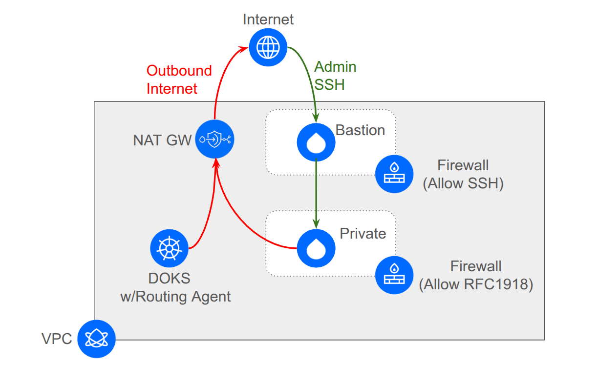

# NAT Gateway for DOKS and Droplets

This reference architecture demonstrates how to route all egress traffic from both a DigitalOcean Kubernetes (DOKS) cluster and standalone Droplets through a VPC NAT Gateway, providing a single static IP address for outbound connectivity.

## Architecture Overview



1. **DigitalOcean VPC**
    * A VPC with a **NAT Gateway** providing centralized egress routing
    * A **DOKS cluster** with the Routing Agent enabled to route pod traffic through the NAT Gateway
    * A **bastion droplet** with default routing and public SSH access for administrative access
    * A **NAT-routed droplet** configured via cloud-init to route all egress traffic through the NAT Gateway

2. **Traffic Flow**
    * **Cluster Pods**: Route CRD configured via the DOKS Routing Agent overrides the default route to use the NAT Gateway
    * **NAT-Routed Droplet**: Cloud-init configuration sets default route to NAT Gateway while preserving metadata access
    * **Bastion Droplet**: Maintains default routing to provide SSH access to the NAT-routed droplet via VPC private IP

3. **Security**
    * **Bastion Firewall**: SSH (port 22) accessible from anywhere (0.0.0.0/0)
    * **Private Firewall**: SSH (port 22) only from RFC1918 private addresses (VPC, K8s clusters, peered networks)
    * Tag-based firewall targeting for easy management

## Use Cases

* **Compliance Requirements**: Organizations requiring traffic to originate from a known, static IP address
* **API Allowlisting**: Third-party services that require IP allowlisting for API access
* **Audit Logging**: Simplified egress traffic monitoring and logging from a single IP
* **Cost Optimization**: Reduce Reserved IP usage by consolidating egress through a single NAT Gateway

## Prerequisites

* Terraform v1.2+ installed
* DigitalOcean API Token (`DIGITALOCEAN_ACCESS_TOKEN` environment variable)
* `doctl` CLI for retrieving kubeconfig (optional)
* `kubectl` for verification steps (optional)
* SSH key configured in DigitalOcean account (for droplet access)

## Deployment

This reference architecture uses a two-stack deployment model:

### Stack 1: Infrastructure (`terraform/1-infra/`)

Provisions the base infrastructure including VPC, NAT Gateway, DOKS cluster, bastion droplet, and NAT-routed droplet.

### Stack 2: Routing Configuration (`terraform/2-routes/`)

Applies the Route custom resource to configure cluster egress routing through the NAT Gateway. Stack 2 automatically reads all necessary outputs from Stack 1 via `terraform_remote_state` - **no variables are required**.

**Important Notes**:
* **Two-stack architecture**: Terraform cannot create a Kubernetes cluster and configure the Kubernetes provider to access that cluster in the same stack. Stack 2 uses a `data.digitalocean_kubernetes_cluster` data source to authenticate with the cluster created in Stack 1.
* **Production deployments**: In real-world scenarios, you would typically apply the Route CRD using a YAML manifest with `kubectl` or a GitOps tool rather than Terraform. Stack 2 exists primarily to demonstrate the complete end-to-end deployment in this reference architecture.
* **Single resource**: Stack 2 contains only the Route CRD resource - it's a minimal stack that showcases how to programmatically configure the DOKS Routing Agent.

See the root [README](../../README.md#how-to-deploy) for general deployment guidance.

## Verification

### Verify Cluster Pod Egress

Deploy a test pod and check its egress IP:

```bash
# Deploy test pod
kubectl run test-egress --image=curlimages/curl:latest --restart=Never -- sh -c "curl -s ifconfig.me"

# Wait for completion
kubectl wait --for=condition=completed pod/test-egress --timeout=60s

# Check the egress IP
kubectl logs test-egress

# Clean up
kubectl delete pod test-egress
```

**Expected Result**: The IP shown should match the `nat_gateway_public_ip` from Stack 1.

### Verify Droplet Egress

Access the NAT-routed droplet via the bastion and check its egress IP:

```bash
ssh -o ProxyCommand="ssh -W %h:%p root@<bastion_public_ip>" \
  root@<droplet_private_ip> "curl -s ifconfig.me"
```

**Expected Result**: The IP returned should match the same `nat_gateway_public_ip`.

**Note**: The NAT-routed droplet must be accessed via the bastion because all its egress traffic (including SSH return packets) routes through the NAT Gateway. This is the recommended pattern for accessing droplets behind NAT.

### Verify Route CRD

Check that the Route custom resource was created successfully:

```bash
kubectl get routes -A
kubectl describe route default-egress-via-nat
```

## Inputs

### Stack 1: Infrastructure

| Name                  | Description                                                                                      | Type           | Default | Required |
|-----------------------|--------------------------------------------------------------------------------------------------|----------------|---------|----------|
| `name_prefix`         | Prefix for all resource names                                                                    | `string`       | n/a     | yes      |
| `region`              | DigitalOcean region slug                                                                         | `string`       | n/a     | yes      |
| `vpc_cidr`            | CIDR block for the VPC                                                                           | `string`       | n/a     | yes      |
| `doks_cluster_subnet` | CIDR block for the DOKS cluster subnet                                                           | `string`       | n/a     | yes      |
| `doks_service_subnet` | CIDR block for the DOKS service subnet                                                           | `string`       | n/a     | yes      |
| `doks_node_count`     | Number of nodes in the DOKS cluster                                                              | `number`       | `1`     | no       |
| `ssh_key_ids`         | List of SSH key IDs or fingerprints for droplet access                                           | `list(string)` | `[]`    | no       |

**Note**: The cluster nodes, bastion droplet, and NAT-routed droplet automatically use the latest Ubuntu LTS image and the most cost-effective droplet size with 2 vCPUs and 4GB memory available in the selected region. Kubernetes version is pinned to 1.33.6-do.0 to avoid a Routing Agent bug in 1.34.x.

### Stack 2: Routing Configuration

Stack 2 requires no variables - it automatically reads all necessary values from Stack 1 via `terraform_remote_state`.

## Outputs

### Stack 1: Infrastructure

| Name                      | Description                                                  |
|---------------------------|--------------------------------------------------------------|
| `vpc_id`                  | ID of the VPC                                                |
| `nat_gateway_id`          | ID of the NAT Gateway                                        |
| `nat_gateway_public_ip`   | Public IP for egress traffic (what external services see)    |
| `nat_gateway_gateway_ip`  | VPC gateway IP for routing configuration                     |
| `cluster_id`              | ID of the DOKS cluster                                       |
| `cluster_name`            | Name of the DOKS cluster                                     |
| `bastion_public_ip`       | Public IP of the bastion droplet                             |
| `bastion_private_ip`      | Private IP of the bastion droplet                            |
| `droplet_public_ip`       | Public IP of the NAT-routed droplet                          |
| `droplet_private_ip`      | Private IP of the NAT-routed droplet                         |

### Stack 2: Routing Configuration

| Name         | Description                              |
|--------------|------------------------------------------|
| `route_name` | Name of the Route CRD that was created   |

## Cleanup

Resources must be destroyed in reverse order:

```bash
# First, destroy the routes (Stack 2)
cd terraform/2-routes
terraform destroy

# Then, destroy the infrastructure (Stack 1)
cd ../1-infra
terraform destroy
```

**Important**: The Route CRD must be removed before destroying the cluster to ensure clean deletion.

## Important Notes

### NAT Gateway IP Addresses

The NAT Gateway has two distinct IP addresses:

* **Public IP** (`nat_gateway_public_ip`): The IP address that external services see when traffic egresses. Use this for allowlisting and verification.
* **Gateway IP** (`nat_gateway_gateway_ip`): The VPC routing table address. This is the IP used in the Route CRD and droplet routing configuration.

### Bastion Access Pattern

The bastion droplet provides secure SSH access to the NAT-routed droplet:

* **Bastion**: Has default routing and SSH accessible from the internet (0.0.0.0/0)
* **NAT-Routed Droplet**: All egress traffic routes through NAT Gateway, accessible only via bastion using SSH ProxyCommand

This pattern is recommended for production deployments where droplets need centralized egress but also require administrative access.

### Firewall Configuration

Two firewalls provide defense in depth:

* **Bastion Firewall**: Targets droplets with "bastion" tag; allows SSH from anywhere
* **Private Firewall**: Targets droplets with "private" tag; allows SSH only from RFC1918 addresses (10.0.0.0/8, 172.16.0.0/12, 192.168.0.0/16)

**Note**: The DOKS cluster is protected by its own managed firewall and does not require a separate firewall resource like Droplets do.

**Note**: Even though a NAT Gateway is used for egress traffic, all Droplets and DOKS nodes still receive a public IP address. Inbound access to these resources is restricted by the firewalls described above.

### Metadata Endpoint Preservation

The NAT-routed droplet's cloud-init configuration includes a critical route to preserve access to the DigitalOcean metadata service:

```yaml
- to: 169.254.169.254/32
  via: <original_gateway>
```

This ensures the droplet can continue to access metadata even after changing the default route to the NAT Gateway.

### Multi-Region Deployments

NAT Gateways are region-specific. For multi-region architectures, deploy a separate NAT Gateway in each region's VPC.

## Cost Considerations

* **NAT Gateway**: Charged per size unit. Each size unit provides 25 Mbps of symmetrical bandwidth and 100 GiB of outbound data transfer per month.
* **DOKS Cluster**: Based on node size and count
* **Droplets**: Based on size (bastion + NAT-routed)
* **Data Transfer**: Standard DigitalOcean egress rates apply for traffic exceeding the NAT Gateway's included transfer

See [DigitalOcean Pricing](https://www.digitalocean.com/pricing) for current rates.

## References

* [DOKS Routing Agent Documentation](https://docs.digitalocean.com/products/kubernetes/how-to/use-routing-agent/)
* [Configure DOKS for NAT Gateway](https://docs.digitalocean.com/products/networking/vpc/how-to/configure-doks-nat-gateway/)
* [Configure Droplets for NAT Gateway](https://docs.digitalocean.com/products/networking/vpc/how-to/configure-droplet-nat-gateway/)
* [VPC NAT Gateway Resource](https://registry.terraform.io/providers/digitalocean/digitalocean/latest/docs/resources/vpc_nat_gateway)

## Troubleshooting

### Route CRD Not Applied

**Symptom**: `kubectl get routes -A` shows no routes

**Solution**: Verify the DOKS Routing Agent is enabled and running:
```bash
kubectl get pods -n kube-system | grep routing-agent
```

### Droplet Cannot Reach Metadata

**Symptom**: Droplet cannot access DigitalOcean metadata service

**Solution**: Verify the metadata route exists:
```bash
ip route | grep 169.254.169.254
```

The route should show: `169.254.169.254 via <original_gateway> dev eth0`

### Egress Traffic Not Using NAT Gateway

**Symptom**: `curl ifconfig.me` shows wrong IP

**Solution**:
1. **For cluster pods**: Check Route CRD status and verify gateway IP is correct
2. **For droplets**: Verify default route points to NAT Gateway:
```bash
ip route show default
```

Should show: `default via <nat_gateway_gateway_ip>`

### SSH Access to NAT-Routed Droplet Fails

**Symptom**: Cannot SSH to NAT-routed droplet

**Solution**: Use the bastion as a jump host with ProxyCommand:
```bash
ssh -o ProxyCommand="ssh -W %h:%p root@<bastion_public_ip>" root@<droplet_private_ip>
```

Ensure your SSH keys are specified in the `ssh_key_ids` var.
