# End-to-End DO VPC to AWS VPC Connection with HA Support

This Terraform module provisions a complete, highly available (HA) end-to-end connection between a DigitalOcean VPC and an AWS VPC using the `partner-network-connect-aws` module.

## Architecture Overview

```mermaid
%%{init: {'theme': 'base', 'themeVariables': { 'primaryColor': '#0069FF', 'primaryTextColor': '#333', 'primaryBorderColor': '#0069FF', 'lineColor': '#0069FF', 'secondaryColor': '#F3F5F9', 'tertiaryColor': '#fff', 'fontFamily': 'arial'}}}%%
flowchart LR
    subgraph Wrapper[" "]
        direction LR
        subgraph DO["DigitalOcean"]
            direction TB

            subgraph DOVPC["VPC"]
                DOKS["DOKS"]
            end

            PNA["Partner Network<br/>Attachment"]
        end

        subgraph Megaport["Megaport"]
            direction TB

            subgraph RedZone["Red Zone"]
                direction LR
                VXC1_DO["VXC"]
                MCR1["MCR"]
                VXC1_AWS["VXC"]
            end

            subgraph BlueZone["Blue Zone (HA)"]
                direction LR
                VXC2_DO["VXC"]
                MCR2["MCR"]
                VXC2_AWS["VXC"]
            end
        end

        subgraph AWS["AWS"]
            direction TB

            DXVIF["DirectConnect<br/>VIF"]

            subgraph AWSVPC["VPC"]
                EC2["EC2 Instance"]
            end
        end

        %% Connections - Red Zone
        DOVPC --> PNA
        PNA --> VXC1_DO
        VXC1_DO --> MCR1
        MCR1 --> VXC1_AWS
        VXC1_AWS --> DXVIF

        %% Connections - Blue Zone (HA)
        PNA --> VXC2_DO
        VXC2_DO --> MCR2
        MCR2 --> VXC2_AWS
        VXC2_AWS --> DXVIF

        %% AWS internal
        DXVIF --> AWSVPC
    end

    %% Styling - Subgraphs
    style Wrapper fill:#FFFFFF,stroke:#FFFFFF
    style DO fill:#E5E4E4,stroke:#0069FF,stroke-width:1px,stroke-dasharray:5
    style DOVPC fill:#C6DDFF,stroke:#0069FF,stroke-width:1px,stroke-dasharray:5
    style Megaport fill:#FFE4C4,stroke:#0069FF,stroke-width:1px,stroke-dasharray:5
    style RedZone fill:#FFD6E0,stroke:#0069FF,stroke-width:1px
    style BlueZone fill:#B7EFFE,stroke:#0069FF,stroke-width:1px
    style AWS fill:#E5E4E4,stroke:#FF9900,stroke-width:1px,stroke-dasharray:5
    style AWSVPC fill:#C6DDFF,stroke:#FF9900,stroke-width:1px,stroke-dasharray:5

    %% Styling - Components
    style DOKS fill:#F3F5F9,stroke:#0069FF,stroke-width:2px
    style PNA fill:#F3F5F9,stroke:#0069FF,stroke-width:2px
    style VXC1_DO fill:#F3F5F9,stroke:#0069FF,stroke-width:2px
    style MCR1 fill:#F3F5F9,stroke:#0069FF,stroke-width:2px
    style VXC1_AWS fill:#F3F5F9,stroke:#0069FF,stroke-width:2px
    style VXC2_DO fill:#F3F5F9,stroke:#0069FF,stroke-width:2px
    style MCR2 fill:#F3F5F9,stroke:#0069FF,stroke-width:2px
    style VXC2_AWS fill:#F3F5F9,stroke:#0069FF,stroke-width:2px
    style DXVIF fill:#F3F5F9,stroke:#FF9900,stroke-width:2px
    style EC2 fill:#F3F5F9,stroke:#FF9900,stroke-width:2px
```



1. **DigitalOcean Side**
    * A DigitalOcean VPC and Kubernetes cluster (DOKS).
    * Two Partner Network Connect (PNC) attachments (red and optional blue) created via Megaport Cloud Router (MCR) and Virtual Cross Connects (VXCs).

2. **AWS Side**
    * An AWS VPC, subnets, and Virtual Gateway.
    * Two Direct Connect Hosted Private Virtual Interface Accepters, one per PNC attachment for HA.

3. **Test EC2 Instance & DOKS Route**
    * A t4g.nano EC2 instance for connectivity testing.

## Submodules Used

### [partner-network-connect-aws](../../modules/partner-network-connect-aws)

This module provisions private connectivity between DigitalOcean and AWS using Megaport's global network. It handles:

- Provisioning a **Megaport Cloud Router (MCR)** in a chosen Megaport location
- Creating a **Virtual Cross Connect (VXC)** between the MCR and AWS’s **Virtual Private Gateway (VGW)**
- Configuring **BGP peering** between the DigitalOcean side and AWS side using user-supplied tunnel IPs and a shared BGP secret
- Setting up **redundancy zones** (e.g. red/blue) with optional high availability support
- Linking additional connections to the primary (via `parent_uuid`) for HA topologies
- Tagging and route propagation compatible with both clouds

### [terraform-aws-modules/vpn-gateway](https://registry.terraform.io/modules/terraform-aws-modules/vpn-gateway/aws/latest)
This module automates the creation of a VPN connection on AWS and associates it with:
- A Virtual Private Gateway
- A Customer Gateway pointing to the DigitalOcean VPN public IP
- Static routes between the VPC and remote CIDR

## Prerequisites

* Terraform v1.2+ installed
* DigitalOcean API Token
* AWS IAM credentials for VPC, EC2, and Direct Connect resources
* Megaport API Key with purchase permissions
* `doctl`, and `kubectl` for to perform ping test (optional)

## Inputs

| Name                      | Description                                                                             | Type     | Default | Required |
| ------------------------- | --------------------------------------------------------------------------------------- | -------- | ------- |----------|
| `name_prefix`             | Prefix for all resource names                                                           | `string` | n/a     | yes      |
| `do_region`               | DigitalOcean region slug (no trailing digit, e.g. `sfo`)                                | `string` | n/a     | yes      |
| `doks_cluster_subnet`     | CIDR block for the DOKS cluster subnet                                                  | `string` | n/a     | yes      |
| `doks_service_subnet`     | CIDR block for DOKS service subnet                                                      | `string` | n/a     | yes      |
| `mp_contract_term_months` | Megaport contract term in months (1, 12, 24, 36)                                        | `number` | `1`     | no       |
| `mp_do_location_red`      | Megaport location for DO VXC & MCR in the Red redundancy zone                           | `string` | n/a     | yes      |
| `mp_aws_location_red`     | Megaport location for AWS VXC in the Red redundancy zone                                | `string` | n/a     | yes      |
| `ha_enabled`              | Enable HA (deploy Blue redundancy zone)                                                 | `bool`   | `false` | no       |
| `mp_do_location_blue`     | Megaport location for DO VXC & MCR in the Blue redundancy zone (when HA enabled)        | `string` | n/a     | no       |
| `mp_aws_location_blue`    | Megaport location for AWS VXC in the Blue redundancy zone (when HA enabled)             | `string` | n/a     | no       |
| `aws_region`              | AWS region (e.g. `us-east-1`)                                                           | `string` | n/a     | yes      |
| `aws_vpc_cidr`            | CIDR block for the AWS VPC                                                              | `string` | n/a     | yes      |
| `aws_region_full_name`    | AWS Region name as shown in Megaport console (e.g. `US East (N. Virginia) (us-east-1)`) | `string` | n/a     | yes      |

See the [partner-network-connect-aws module README](../../modules/partner-network-connect-aws) for guidance on how to find the values for the `mp_do_location_red` and `mp_aws_location_red` inputs.

## Outputs

| Name                           | Description                                                         |
| ------------------------------ | ------------------------------------------------------------------- |
| `aws_instance_ip`              | Private IP of the t4g.nano EC2 instance used for testing            |
| `kubeconfig_save_command`      | `doctl` command to configure `kubectl` for the created DOKS cluster |
| `ping_test_command`            | `kubectl` command to run a pod that pings the EC2 instance          |
| `partner_attachment_uuid_red`  | UUID of the Red PNC attachment                                      |
| `partner_attachment_uuid_blue` | UUID of the Blue PNC attachment (null if HA disabled)               |

## Validation

After running `terraform apply`, the module will output three key values that will look like the following. The values here are for example and yours might look a bit different.


```
aws_instance_ip = "192.168.0.108"
kubeconfig_save_command = "doctl kubernetes cluster kubeconfig save pnc-test"
ping_test_command = "kubectl run -it --rm test-pod --image=nicolaka/netshoot -- ping 192.168.0.108"
```

Assuming you have doctl, and kubectl installed you can copy the command output of `kubeconfig_save_command` into your terminal to configure connection to DOKS cluster. Then you can copy and paste the output of the `ping_test_command` into your terminal and it will deploy a pod and run a ping to the EC2 instance.
