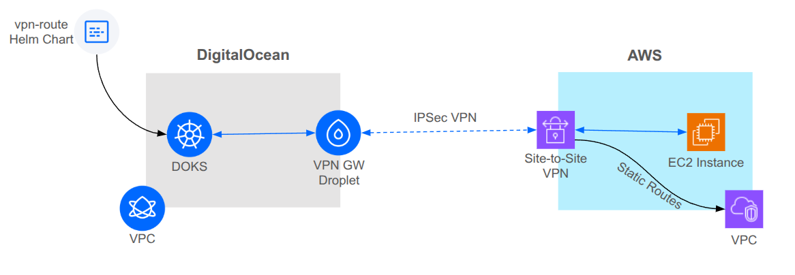

# Site-to-Site VPN With AWS

This repository provides a reference architecture and Terraform-based implementation for establishing a site-to-site IPSec VPN connection between a DigitalOcean environment (including a VPC and a DOKS cluster) and an AWS VPC (with EC2 instance). It demonstrates how to deploy, configure, and test the VPN tunnel end-to-end using a reusable Terraform module and accompanying resources.

## Architecture Overview



1. **DigitalOcean Side**
    * A **VPC** with a **DigitalOcean Droplet** acting as an IPSec VPN Gateway. A **Reserved IP** is assigned to the Droplet.
    * A **DOKS cluster** in the same VPC. Traffic from DOKS nodes to the AWS VPC is routed through the VPN Gateway via the DOKS Routing Agent with route installed using a Helm chart.

2. **AWS Side**
    * A **VPC** with a single **public subnet** housing an **EC2 instance** used for connectivity testing.
    * An **AWS Site-to-Site VPN** Gateway (Virtual Private Gateway attached to the VPC) and a **Customer Gateway** configuration pointing at the DigitalOcean Reserved IP.
    * **Static routes** injected into the AWS VPC route table for directing traffic destined to the DigitalOcean VPC and DOKS CIDRs through the VPN.

## Production Architecture Considerations

Terraform can't configure a Kubernetes cluster in the same session used to create the cluster. While this reference architecture is setup to create everything as part of the same session this is just for example purposes. The recommended approach would be to create the DO and AWS VPCs and DOKS clusters using a separate module to be applied separately. Once those are created, then have a separate module to create the site-to-site VPN. As part of the VPN module you can have Terraform also create the routes in the DOKS cluster using the [Kubernetes Provider](https://registry.terraform.io/providers/hashicorp/kubernetes/latest/docs)].

## Prerequisites

* **Terraform** v1.2+ installed locally
* **DigitalOcean API Token** with privileges to manage Droplets, VPCs, Reserved IPs
* **AWS Credentials** configured (IAM user/role) with permissions for VPC, Subnet, EC2, VPN Gateway, Customer Gateway, and Route Tables
* (Optional) **doctl**,**helm**, and **kulectl** installed for testing DOKS connectivity

---

## Validation

After running `terraform apply`, the module will output three key values that will look like the following. The values here are for example and yours might look a bit different.

```bash
aws_instance_ip = "192.168.100.179"
helm_route_install_command = "doctl kubernetes cluster kubeconfig save vpn-test; helm upgrade vpn-route ../helm/vpn-route --install --set awsVpcCidr=192.168.100.0/24 --set vpnGwIp=10.0.0.3"
ping_test_command = "kubectl run -it --rm test-pod --image=nicolaka/netshoot -- ping 192.168.100.179"
```

Assuming you have doctl, helm and kubectl installed you can copy the command output of `helm_route_install_command` into your terminal to configure the route in the DOKS cluster. Once the route is configured you can copy and paste the output of the`ping_test_command` into your terminal and it will deploy a pod and run a ping to the EC2 instance.

## Deploy

### Inputs

| Name                  | Description                                                                                                       | Type           | Default | Required |
|-----------------------|-------------------------------------------------------------------------------------------------------------------|----------------|---------|----------|
| `name_prefix`         | Name prefix to use for all resources created by this module                                                       | `string`       | —       | yes      |
| `do_region`           | DO region slug for the region the droplet will be deployed into                                                   | `string`       | —       | yes      |
| `droplet_size`        | DO size slug used for the droplet                                                                                 | `string`       | —       | yes      |
| `droplet_image`       | DO image slug to run on the droplet, must be Ubuntu-based                                                         | `string`       | —       | yes      |
| `droplet_ssh_keys`    | A list of SSH key IDs or fingerprints to enable on the droplet                                                    | `list(number)` | `[]`    | no       |
| `do_vpc_cidr`         | CIDR to use for the DO VPC                                                                                        | `string`       | —       | yes      |
| `doks_cluster_subnet` | CIDR for the DOKS Cluster Subnet                                                                                  | `string`       | —       | yes      |
| `doks_service_subnet` | CIDR for the DOKS Service Subnet                                                                                  | `string`       | —       | yes      |
| `aws_region`          | AWS Region ID in which the AWS VPC will be created                                                                | `string`       | —       | yes      |
| `aws_vpc_cidr`        | CIDR to use for the AWS VPC                                                                                       | `string`       | —       | yes      |
| `vpn_psk`             | Pre-shared key to use for the AWS Site-to-Site VPN connection (8–64 alphanumeric, `.`, or `_` as required by AWS) | `string`       | —       | yes      |


### Outputs

| Name                         | Description                                                                     |
|------------------------------|---------------------------------------------------------------------------------|
| `aws_instance_ip`            | IP Address of the EC2 Instance created for testing                              |
| `doks_cluster_id`            | The Id of the DOKS cluster. This value is used in the testing of the module.    |
| `helm_route_install_command` | Commands used to install the vpn-route Helm chart into the created DOKS cluster |
| `ping_test_command`          | Commands used to deploy a pod into the DOKS cluster and ping the EC2 instance   |

---

## Considerations & Best Practices

* **PSK Security**: Store your pre-shared key securely and do not check it into your revision control system (e.g. GitHub).
* **Multi-Subnet AWS VPCs**: This example uses a single subnet in the AWS VPC but any number of subnets is supported.
* **Costs**: Be aware of data transfer and VPN connection charges on AWS.
* **Cloud-Init Caveats**: cloud-init is used to configure the VPN GW Droplet. Changes such as updating the `vpn_psk`or `aws_vpc_cidr`will cause the VPN Droplet to be recreated. This likely will mean the private IP address of the VPN droplet will be changed and any routes will need to be updated as well.
