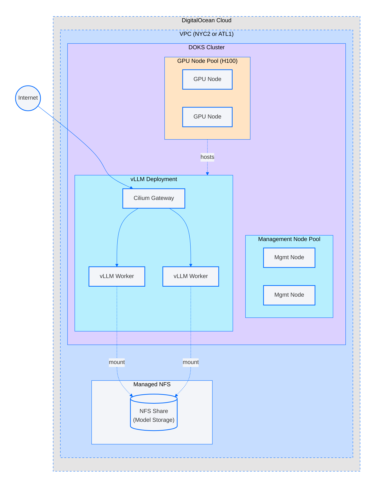

# vLLM on DOKS with Managed NFS

This reference architecture demonstrates how to deploy vLLM on DigitalOcean Kubernetes Service (DOKS) using Managed NFS for model storage. The architecture provides an example of how to use NFS to provide a single source for model weights allowing scaling an inference cluster easily.

## Architecture Overview



1. **DigitalOcean VPC**
   * Deployed in a region with both H100 GPUs and Managed NFS (currently **NYC2** or **ATL1**)
   * A VPC containing all resources with private networking
   * **DOKS Cluster** with management and GPU node pools
   * **Managed NFS Share** for shared model storage

2. **DOKS Cluster**
   * **Management Node Pool**: Auto-scaling basic droplets for system services
   * **GPU Node Pool**: H100 single-GPU droplets (`gpu-h100x1-80gb`) for vLLM inference

3. **vLLM Deployment**
   * **vLLM Workers**: Replicas running on H100 GPUs, serving your configured model
   * **Gateway API**: Cilium Gateway providing internet-accessible inference endpoints

## Default Model

By default, this reference architecture deploys [Qwen/Qwen2.5-0.5B-Instruct](https://huggingface.co/Qwen/Qwen2.5-0.5B-Instruct), a small open-source model that does not require a HuggingFace API token to download. This model is included for demonstration purposes only - it allows you to quickly test the architecture without needing to configure authentication.

**For production deployments**, you should use a larger, more capable model appropriate for your use case. The `model_id` variable allows you to specify any HuggingFace model, provided you have:
- Access to the model (some models are gated and require approval)
- A HuggingFace API token (if the model requires authentication)
- Sufficient GPU memory to run the model (larger models require more VRAM)

## Why Managed NFS for LLM Model Storage?

Using DigitalOcean Managed NFS for storing LLM model files provides significant advantages over alternatives like init containers or block storage:

| Benefit | Description                                                                                                                        |
|---------|------------------------------------------------------------------------------------------------------------------------------------|
| **Download Once, Use Many** | Model files are downloaded once to shared storage. All vLLM replicas read from the same source with no redundant downloads per pod. |
| **No Init Container Complexity** | vLLM pods mount the NFS share directly. No init containers needed to download models for Spaces object store.                      |
| **Model Version Management** | Store multiple model versions on NFS. Switch models by updating the model path - no rebuilding containers or re-downloading.       |
| **ReadWriteMany Access** | NFS supports concurrent read access from all GPU nodes, unlike block storage which is typically ReadWriteOnce.                     |
| **Managed Service Benefits** | DigitalOcean handles NFS infrastructure, backups, and availability. No self-managed NFS servers to maintain.                       |

## Prerequisites

* DigitalOcean account with H100 GPU quota in a region with both GPUs and Managed NFS (e.g. NYC2 or ATL1)
* Terraform v1.2+ installed with DigitalOcean provider version supporting NFS `host` and `mount_path` attributes
* `kubectl` CLI installed
* `doctl` CLI configured with API token
* DigitalOcean API Token (`DIGITALOCEAN_ACCESS_TOKEN` environment variable)
* (Optional) HuggingFace API token if using gated models like Llama

## Deployment

This reference architecture uses a two-stack Terraform deployment model:

- **Stack 1 (`terraform/1-infra`)**: Infrastructure - VPC, DOKS cluster, GPU node pool, and NFS share
- **Stack 2 (`terraform/2-vllm`)**: Kubernetes resources - namespace, PV/PVC, model download job, vLLM deployment, service, and Gateway

The `k8s/` directory contains YAML manifests as documentation reference for what Stack 2 deploys.

### Step 1: Deploy Infrastructure (Stack 1)

Provision the VPC, DOKS cluster, and NFS share.

First, create a `terraform.tfvars` file with your configuration:

```hcl
name_prefix         = "my-vllm"
region              = "nyc2"  # Must be a region with both H100 GPUs and Managed NFS
vpc_cidr            = "10.200.0.0/22"
doks_cluster_subnet = "172.16.0.0/20"
doks_service_subnet = "192.168.0.0/22"
nfs_size_gb         = 1000
gpu_node_count      = 2
```

Then apply the Terraform configuration:

```bash
cd terraform/1-infra

# Initialize Terraform
terraform init

# Review the plan
terraform plan

# Apply the configuration
terraform apply
```

### Step 2: Configure kubectl

Get credentials for the DOKS cluster:

```bash
doctl kubernetes cluster kubeconfig save $(terraform output -raw cluster_name)
```

### Step 3: Deploy vLLM Stack (Stack 2)

Stack 2 reads outputs from Stack 1 via `terraform_remote_state` and deploys all Kubernetes resources:

1. Creates the `vllm` namespace
2. Configures NFS PersistentVolume using `nfs_host` and `nfs_mount_path` from Stack 1
3. Creates PersistentVolumeClaim bound to the NFS PV
4. (Optional) Creates Kubernetes secret with your HuggingFace token if provided
5. Runs a Job to download the model to NFS (waits for completion)
6. Deploys vLLM on GPU nodes
7. Creates ClusterIP service and Gateway API resources for external access

```bash
cd ../2-vllm

# Initialize Terraform
terraform init

# Apply with default model (Qwen2.5-0.5B-Instruct, no token required)
terraform apply

# OR apply with a custom model (e.g., a gated model requiring HF token)
terraform apply -var="model_id=meta-llama/Llama-3.1-8B-Instruct" -var="hf_token=YOUR_HUGGINGFACE_TOKEN"
```

**Note:** The model download job may take several minutes depending on model size and network speed. Terraform will wait for the job to complete before creating the vLLM deployment.

## Verification

### Check Pod Status

```bash
kubectl get pods -n vllm -o wide
```

Expected output shows vLLM pod running on GPU nodes:
```
NAME                    READY   STATUS    RESTARTS   AGE   NODE
vllm-xxx-xxx            1/1     Running   0          5m    vllm-test-gpu-h100-xxx
```

Wait until it's Running to move on to the next step.

### Get Gateway External IP

```bash
kubectl get gateway vllm-gateway -n vllm
```

### Test Inference via Gateway

```bash
GATEWAY_IP=$(kubectl get gateway vllm-gateway -n vllm -o jsonpath='{.status.addresses[0].value}')

# List available models
curl -s http://${GATEWAY_IP}/v1/models | jq .

# Test chat completion (using default Qwen model)
curl -s http://${GATEWAY_IP}/v1/chat/completions \
  -H "Content-Type: application/json" \
  -d '{
    "model": "Qwen2.5-0.5B-Instruct",
    "messages": [{"role": "user", "content": "Hello, how are you?"}],
    "max_tokens": 50
  }' | jq .
```

## Inputs

### Stack 1 (1-infra)

| Name | Description | Type | Default | Required |
|------|-------------|------|---------|----------|
| `name_prefix` | Prefix for all resource names | `string` | n/a | yes |
| `region` | DigitalOcean region (must have H100 GPUs and Managed NFS) | `string` | n/a | yes |
| `vpc_cidr` | CIDR block for VPC | `string` | n/a | yes |
| `doks_cluster_subnet` | CIDR block for DOKS cluster subnet | `string` | n/a | yes |
| `doks_service_subnet` | CIDR block for DOKS service subnet | `string` | n/a | yes |
| `nfs_size_gb` | Size of NFS share in GB for model storage | `number` | n/a | yes |
| `gpu_node_count` | Number of H100 GPU nodes in the GPU node pool | `number` | `0` | no |
| `doks_control_plane_ha` | Enable high availability for DOKS control plane | `bool` | `false` | no |
| `management_node_pool_min_nodes` | Minimum nodes in management node pool | `number` | `2` | no |
| `management_node_pool_max_nodes` | Maximum nodes in management node pool | `number` | `3` | no |

### Stack 2 (2-vllm)

| Name | Description | Type | Default | Required |
|------|-------------|------|---------|----------|
| `model_id` | HuggingFace model ID to download and serve | `string` | `Qwen/Qwen2.5-0.5B-Instruct` | no |
| `hf_token` | HuggingFace API token for gated models | `string` | `""` | no |
| `replicas` | Number of vLLM replicas (set > 1 for HA) | `number` | `1` | no |
| `quantization` | Quantization method (e.g., `fp8`) | `string` | `""` | no |

## Outputs

### Stack 1 (1-infra)

| Name | Description |
|------|-------------|
| `vpc_id` | ID of the VPC |
| `cluster_id` | ID of the DOKS cluster |
| `cluster_name` | Name of the DOKS cluster |
| `cluster_endpoint` | Endpoint URL for the DOKS cluster API |
| `nfs_share_id` | ID of the NFS share |
| `nfs_share_name` | Name of the NFS share |
| `nfs_host` | NFS server IP address for PersistentVolume configuration |
| `nfs_mount_path` | NFS mount path for PersistentVolume configuration |
| `nfs_size_gb` | Size of the NFS share in GB |
| `gpu_node_pool_id` | ID of the GPU node pool |
| `gpu_node_pool_name` | Name of the GPU node pool |

### Stack 2 (2-vllm)

| Name | Description |
|------|-------------|
| `namespace` | Kubernetes namespace where vLLM is deployed |
| `service_name` | Name of the vLLM ClusterIP service |
| `service_port` | Port of the vLLM service |
| `gateway_name` | Name of the Gateway resource for external access |
| `model_id` | The HuggingFace model ID being served |
| `model_name` | The model name used for inference requests |
| `replicas` | Number of vLLM replicas deployed |
| `quantization` | Quantization method used for model inference |

## Cleanup

Remove resources in reverse order (Stack 2 before Stack 1):

```bash
# Destroy Stack 2 (Kubernetes resources)
cd terraform/2-vllm
terraform destroy

# Destroy Stack 1 (Infrastructure)
cd ../1-infra
terraform destroy
```

## Using Different Models

To deploy a different model, set the `model_id` variable in Stack 2:

```bash
# Public models (no token required)
terraform apply -var="model_id=Qwen/Qwen2.5-7B-Instruct"
terraform apply -var="model_id=microsoft/phi-2"

# Gated models (token required)
terraform apply -var="model_id=meta-llama/Llama-3.1-8B-Instruct" -var="hf_token=YOUR_TOKEN"
terraform apply -var="model_id=mistralai/Mistral-7B-Instruct-v0.3" -var="hf_token=YOUR_TOKEN"
```

**Important considerations when choosing a model:**
- Ensure the model fits in GPU memory (H100 has 80GB VRAM)
- Larger models require more NFS storage space
- Some models have specific licensing terms
- Gated models require HuggingFace account approval before use

## Production Considerations

This reference architecture uses simple round-robin load balancing via Gateway API. For production deployments, consider:

* **KV Cache Aware Routing**: Routes requests to replicas that already have relevant KV cache entries, reducing redundant computation
* **Prefix Aware Routing**: Routes requests with similar prompts to the same replica to maximize prefix cache hits
* **Model Replicas**: Increase `replicas` in the deployment for higher throughput
* **Resource Limits**: Configure appropriate memory limits based on your model size
* **Health Checks**: Tune readiness/liveness probe timings based on model load time
* **TLS Termination**: Add TLS certificates to the Gateway for HTTPS endpoints
* **Larger Models**: For production workloads, use a more capable model than the default Qwen2.5-0.5B-Instruct

These optimizations can significantly improve throughput and reduce latency for multi-replica deployments.

## High Availability Configuration for Upgrade Testing

This reference architecture includes built-in support for testing zero-downtime upgrades with multiple replicas. The deployment incorporates several best practices that ensure service continuity during rolling updates and node maintenance:

### Built-in Resilience Features

| Feature | Description |
|---------|-------------|
| **PodDisruptionBudget** | Limits voluntary disruptions to one pod at a time, ensuring service availability during node drains |
| **PreStop Hook** | Drains in-flight requests before pod termination by polling vLLM metrics for running/waiting requests |
| **Pod Anti-Affinity** | Spreads replicas across different nodes, preventing single node failures from affecting all replicas |
| **Startup Probe** | Allows up to 120 seconds for model loading before readiness/liveness probes begin |
| **Graceful Termination** | 70-second termination grace period gives time for request draining |
| **Rolling Update Strategy** | `maxSurge: 0` and `maxUnavailable: 1` ensure controlled pod replacement for GPU-constrained clusters |

### Deploying with Multiple Replicas

To test high availability and upgrade resilience, deploy with multiple GPU nodes and replicas:

**Stack 1 (terraform/1-infra):**
```hcl
name_prefix         = "vllm-ha-test"
region              = "nyc2"
vpc_cidr            = "10.200.0.0/22"
doks_cluster_subnet = "172.16.0.0/20"
doks_service_subnet = "192.168.0.0/22"
nfs_size_gb         = 1000
gpu_node_count      = 3  # One node per replica for anti-affinity
```

**Stack 2 (terraform/2-vllm):**
```hcl
model_id     = "Qwen/Qwen2.5-72B-Instruct"
replicas     = 3
quantization = "fp8"  # FP8 quantization for 72B model on 80GB GPU
```

### Testing Upgrade Resilience

With the HA configuration deployed, you can validate zero-downtime behavior:

1. **Rolling Update Test**: Update the vLLM image version and observe pods replacing one at a time
   ```bash
   kubectl set image deployment/vllm vllm=vllm/vllm-openai:v0.x.x -n vllm
   kubectl rollout status deployment/vllm -n vllm
   ```

2. **Node Drain Test**: Drain a GPU node and verify the PDB prevents service disruption
   ```bash
   kubectl drain <node-name> --ignore-daemonsets --delete-emptydir-data
   ```

3. **Traffic During Upgrades**: Run continuous traffic and verify no failed requests
   ```bash
   GATEWAY_IP=$(kubectl get gateway vllm-gateway -n vllm -o jsonpath='{.status.addresses[0].value}')
   while true; do
     curl -s -o /dev/null -w "%{http_code}\n" http://${GATEWAY_IP}/v1/models
     sleep 1
   done
   ```

## Troubleshooting

### Pods Not Scheduling on GPU Nodes

**Symptom**: vLLM pods stuck in `Pending` state

**Solution**: Verify GPU node pool exists and has available nodes:
```bash
kubectl get nodes -l doks.digitalocean.com/node-pool=<gpu-node-pool-name>
kubectl describe node <gpu-node-name> | grep -A5 "Allocatable:"
```

### Model Download Job Fails

**Symptom**: `model-download` job shows error

**Solution**: Check job logs:
```bash
kubectl logs job/model-download -n vllm
```

Common issues:
* Invalid HuggingFace token (for gated models)
* No access to gated model (request access on HuggingFace first)
* NFS mount issues (verify PV/PVC are bound)
* Insufficient NFS storage space

### Gateway Not Getting External IP

**Symptom**: Gateway shows no address

**Solution**: Verify Cilium Gateway API is enabled:
```bash
kubectl get gatewayclass
kubectl describe gateway vllm-gateway -n vllm
```

### vLLM Pods Crash on Startup

**Symptom**: Pods in `CrashLoopBackOff`

**Solution**: Check pod logs for model loading errors:
```bash
kubectl logs -l app=vllm -n vllm --tail=100
```

Common issues:
* Model not found on NFS (run download job first)
* Insufficient GPU memory for the model
* Model architecture not supported by vLLM

## References

* [vLLM Documentation](https://docs.vllm.ai/)
* [DigitalOcean Managed NFS](https://docs.digitalocean.com/products/storage/nfs/)
* [DigitalOcean GPU Droplets](https://docs.digitalocean.com/products/droplets/concepts/gpu/)
* [Gateway API Documentation](https://gateway-api.sigs.k8s.io/)
* [Cilium Gateway API](https://docs.cilium.io/en/stable/network/servicemesh/gateway-api/gateway-api/)
* [HuggingFace Model Hub](https://huggingface.co/models)
